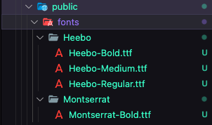

# Set up custom fonts

## Step 1 (add files)

Add your fonts files in /apps/next/public/fonts
\
\


## Step 2 (setup for Next.js)

in /apps/next/pages/\_document.tsx edit **font** variable like this :

```sh
const fonts = [
  {
    name: '#FONT-FAMILY-NAME-1#',
    weights: ['#FONT-WEIGHT-1#', '#FONT-WEIGHT-2#', '#FONT-WEIGHT-3#'],
  },
  {
    name: '#FONT-FAMILY-NAME-1#',
    weights: ["#FONT-WEIGHT-1#", ETC...],
  },
  ETC...
];
```

example:

```sh
const fonts = [
  {
    name: 'Heebo',
    weights: ['Bold', 'Medium', 'Regular'],
  },
  {
    name: "Montserrat",
    weights: ["Bold"],
  }
];
```

## Step 3 (setup for React-Native)

in /apps/expo/Fonts.tsx, edit the useFonts() hook:

example:

```sh
  const [ready] = useFonts({
        ['Heebo-Regular']: require('../next/public/fonts/Heebo/Heebo-Regular.ttf'),
        ['Heebo-Medium']: require('../next/public/fonts/Heebo/Heebo-Medium.ttf'),
        ['Heebo-Bold']: require('../next/public/fonts/Heebo/Heebo-Bold.ttf'),
        ['Montserrat-Bold']: require('../next/public/fonts/Montserrat/Montserrat-Bold.ttf'),
    })
```

## Step 4 (setup fonts in tailwind)

Edit theme.fontFamily object in packages/app/design/tailwind/theme.js

example:

```sh
const theme = {
  fontFamily: {
    default: ['Heebo-Regular'],
    regular: ['Heebo-Regular'],
    medium: ['Heebo-Medium'],
    bold: ['Heebo-Bold'],
    title: ['Montserrat-Bold'],
  },
}

```

## Use fonts 

just use tailwind fonts classes **font-#fontname#**, #fontname# are the keys setup in step 4

example: 

```sh
<Text className="font-bold">Hello mom !</Text>
```